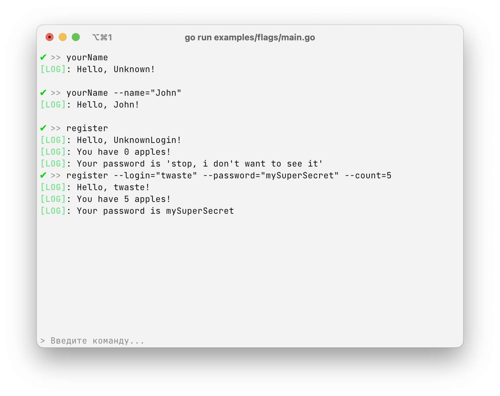

# `flags` - using flags

Flags are a very convenient thing for using commands.



### How the flags are described:

To create a flag in a command, you need to describe the `Flags` field:

```go
Commands: []*replyme.Command: {
	Flags: []replyme.Flag: {
	    &replyme.FlagValue[string]{
			Name: "myStringFlag",
			Usage: "Flag for a string"
        }
    }
}
```

The available types of flags (which can be specified in `replyme.FlagValue[T]`):

| Type | Usage |
|------------|----------------------------------|
| `string`   | `--name="value"`, `--name value` |
| `int`      | `--name=0`,`--name 0`            |
| `bool`     | `--name`                         |
| `[]string` | `--name="hello,my,test"`         |
| `[]int`    | `--name=1,2,3,4`                 |

The types are specified in `*replyme.FlagValue[T]`, where `T` is one of the available types. You can specify several flags, and you can use them in any convenient order in a command.

To see how it works, open the [flags/main.go](./main.go), you can see an example in it