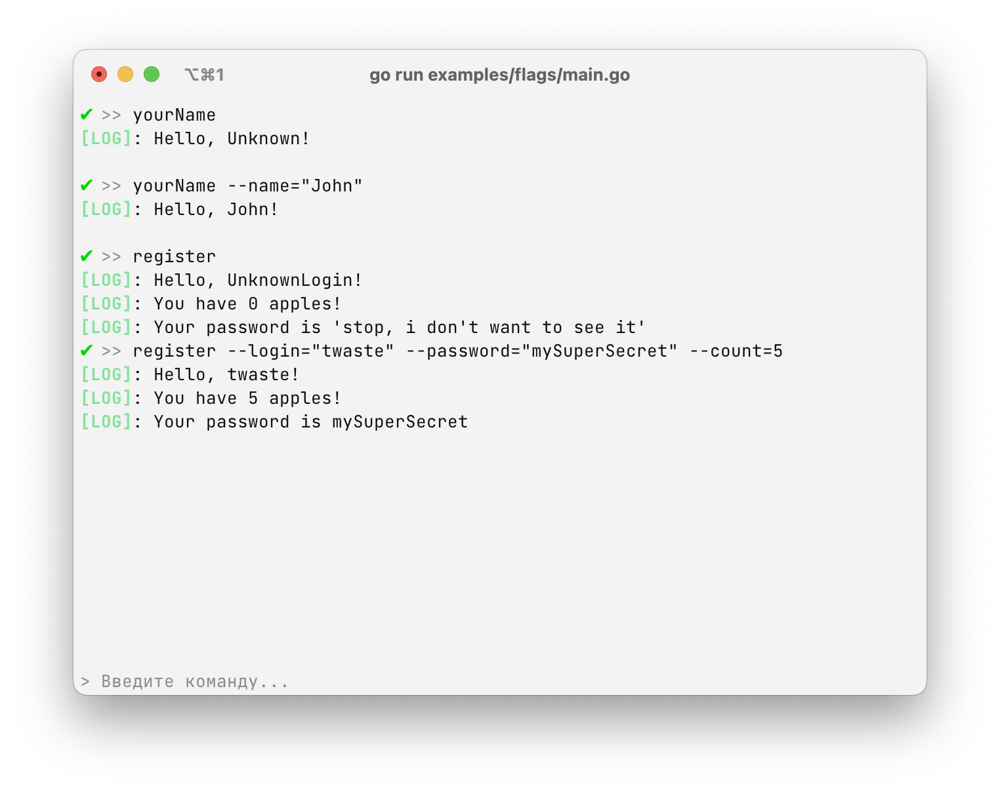

# `flags` - использование флагов

Флаги - очень удобная вещь для использования команд. 



### Как описываются флаги:

Чтобы создать флаг в команде, необходимо описать поле `Flags`: 

```go
Commands: []*replyme.Command: {
	Flags: []replyme.Flag: {
	    &replyme.FlagValue[string]{
			Name: "myStringFlag",
			Usage: "Флаг для строки"
        }
    }
}
```

Доступные типы флагов (которые можно указывать у `replyme.FlagValue[T]`):

| Тип        | Использование                    |
|------------|----------------------------------|
| `string`   | `--name="value"`, `--name value` |
| `int`      | `--name=0`,`--name 0`            |
| `bool`     | `--name`                         |
| `[]string` | `--name="hello,my,test"`         |
| `[]int`    | `--name=1,2,3,4`                 |

Типы указываются в `*replyme.FlagValue[T]`, где `T` это один из доступных типов. Флагов можно указывать несколько, в команде их можно использовать в любом удобном порядке.

Для того чтобы посмотреть, как это работает, откройте файл [flags/main.go](./main.go), в нем можно посмотреть пример

