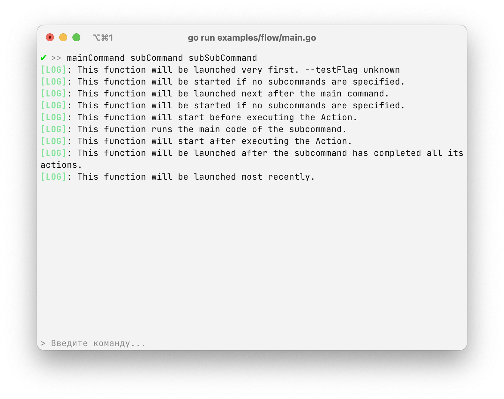

# `flow` - execution flow



The commands in the "replyme" are executed according to some algorithm in order to provide a more convenient control method.

### Execution sequence

There are three types of actions used to control execution:

- `Action`
- `Before`
- `OnEnd`

More information about them can be found below.

In order to understand the flow of execution, take the command: `mainCommand subCommand subSubCommand`, all code will be executed in this order:

```plain text
1. -> mainCommand/Before
2.    -> subCommand/Before
3.         -> subSubCommand/Before
4.         -> subSubCommand/Action
5.         -> subSubCommand/OnEnd
6.     -> subCommand/OnEnd
7. -> mainCommand/OnEnd
```

That is, first the functions of all commands are run `Before`, after that the `Action` of the last subcommand is run, and after that all the `OnEnd` commands are run in reverse order.

In the `Before` field, you can determine whether further execution will be started or not. This can be done by returning `false' (for more information on how to do this, see below). If, for example, `false` is returned in the `subCommand` command, then it will be executed this way:

```plain text
1. -> mainCommand/Before
2.    -> subCommand/Before
```

After `subCommand/Before`, execution will stop

### `Action' - the main launch

Using the `Action` field, you can specify the main function that will be executed if it is the main command or the last subcommand. If you specify `Action` for all the subcommands, then the higher-level subcommands will not be executed.

For example, the code of the `mainCommand subCommand` command:

```go
Commands: []*replyme.Command{
    {
        Name: "mainCommand",
        // This code will not be executed
        Action: func (ctx *replyme.Context) error {
            ctx.Print("Test!")
            return nil
        },
        Subcommands: []*replyme.Command{
            {
                Name: "subCommand",
                // This code will be executed
                Action: func (ctx *replyme.Context) error {
                    ctx.Print("Sub test!")
                    return nil
                }
            }
        }
    }
}
```

But if you run the `mainCommand` command, then only its `Action` will be launched.

### `Before' - pre-launch

In order to execute a certain code before launching an `Action`, the `Before` field is used - you can use it to perform a certain action, and then specify whether to start further execution or not.

Let's go back to the `mainCommand subCommand` example and change it a bit.:

```go
Commands: []*replyme.Command{
    {
        Name: "mainCommand",
        Before: func (ctx *replyme.Context) (bool, error) {
            // we execute some code and return
            return true, nil // the command will continue execution
            // or
return false, nil // the command will finish executing
        },
        Action: func (ctx *replyme.Context) error {
            ctx.Print("Test!")
            return nil
        },
        Subcommands: []*replyme.Command{
            {
                Name: "subCommand",
                // The `Before` field can also be described here
                Action: func (ctx *replyme.Context) error {
                    ctx.Print("Sub test!")
                    return nil
                }
            }
        }
    }
}
```

Thus, before launching the `Action`, you can directly influence the launch.

### `OnEnd' - completion of execution

After the function has completed its work, you can perform certain functions for both the main commands and the subcommands. When using the subcommands, all the `OnEnd` fields will be executed in reverse order, again using the example with the `mainCommand subCommand`:

```go
Commands: []*replyme.Command{
    {
        Name: "mainCommand",
        Action: func (ctx *replyme.Context) error {
            ctx.Print("Test!")
            return nil
        },
        OnEnd: func (ctx *replyme.Context) error {
            ctx.Print("Second onEnd")
            return nil
        }
        Subcommands: []*replyme.Command{
            {
                Name: "subCommand",
                Action: func (ctx *replyme.Context) error {
                    ctx.Print("Sub test!")
                    return nil
                },
                OnEnd: func (ctx *replyme.Context) error {
                    ctx.Print("First onEnd")
                    return nil
                }
            }
        }
    }
}
```