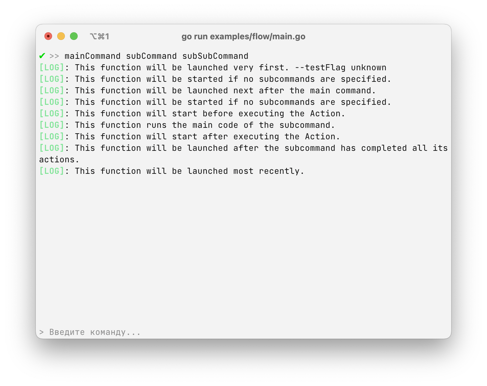

# `flow` - поток выполнения



Команды в `replyme` выполняются по некоторому алгоритму, для того чтобы дать более удобный способ управления.

### Последовательность выполнения

Для управления выполнением используется три вида действий:

- `Action`
- `Before`
- `OnEnd`

Подробнее о них можно посмотреть ниже.

Для того чтобы понять поток выполнения, возьмем команду: `mainCommand subCommand subSubCommand`, весь код будет выполняться в таком порядке:

```plain text
1. -> mainCommand/Before
2.    -> subCommand/Before
3.         -> subSubCommand/Before
4.         -> subSubCommand/Action
5.         -> subSubCommand/OnEnd
6.     -> subCommand/OnEnd
7. -> mainCommand/OnEnd
```

То есть сначала запускаются `Before` функции всех команд, после этого запускается `Action` последней подкоманды, и после запускаются все `OnEnd` команды в обратном порядке.

В поле `Before` можно определить - будет ли запускаться дальнейшее выполнение или нет. Это можно сделать с помощью возврата `false` (подробнее о том как это сделать - смотрите ниже). Если к примеру будет возвращен `false` в команде `subCommand`, то тогда выполняться она будет таким образом:

```plain text
1. -> mainCommand/Before
2.    -> subCommand/Before
```

После `subCommand/Before` выполнение остановится

### `Action` - основной запуск

С помощью поля `Action` можно задать основную функцию, которая выполнится если это основная команда или последняя подкоманда. Если вы указываете `Action` для всех подкоманд, то вышестоящие подкоманды выполнены не будут. 

Например - код команды `mainCommand subCommand`:

```go
Commands: []*replyme.Command{
    {
        Name: "mainCommand",
        // Этот код выполнен не будет
        Action: func (ctx *replyme.Context) error {
            ctx.Print("Test!")
            return nil
        },
        Subcommands: []*replyme.Command{
            {
                Name: "subCommand",
                // Этот код будет выполнен
                Action: func (ctx *replyme.Context) error {
                    ctx.Print("Sub test!")
                    return nil
                }
            }
        }
    }
}
```

Но если запустить команду `mainCommand`, то тогда будет запущен только его `Action`.

### `Before` - предварительный запуск

Для того чтобы выполнять некий код перед запуском `Action`, используется поле `Before` - с помощью него можно выполнить определенное действие, и дальше указать - запускать дальнейшее выполнение или нет.

Вернемся к примеру `mainCommand subCommand` и немного изменим его:

```go
Commands: []*replyme.Command{
    {
        Name: "mainCommand",
        Before: func (ctx *replyme.Context) (bool, error) {
            // выполняем некий код и возвращаем
            return true, nil // команда продолжит выполнение
            // или
            return false, nil // команда закончит выполнение
        },
        Action: func (ctx *replyme.Context) error {
            ctx.Print("Test!")
            return nil
        },
        Subcommands: []*replyme.Command{
            {
                Name: "subCommand",
                // Здесь также можно описать поле `Before`
                Action: func (ctx *replyme.Context) error {
                    ctx.Print("Sub test!")
                    return nil
                }
            }
        }
    }
}
```

Таким образом перед запуском `Action` можно напрямую влиять на запуск.

### `OnEnd` - завершение выполнения

После того как функция завершила работу, можно выполнить определенный функционал как и у основных команд, так и подкоманд. При использовании подкоманд, все поля `OnEnd` будут выполняться в обратном порядке, снова воспользуемся примером с `mainCommand subCommand`:

```go
Commands: []*replyme.Command{
    {
        Name: "mainCommand",
        Action: func (ctx *replyme.Context) error {
            ctx.Print("Test!")
            return nil
        },
        OnEnd: func (ctx *replyme.Context) error {
            ctx.Print("Second onEnd")
            return nil
        }
        Subcommands: []*replyme.Command{
            {
                Name: "subCommand",
                Action: func (ctx *replyme.Context) error {
                    ctx.Print("Sub test!")
                    return nil
                },
                OnEnd: func (ctx *replyme.Context) error {
                    ctx.Print("First onEnd")
                    return nil
                }
            }
        }
    }
}
```