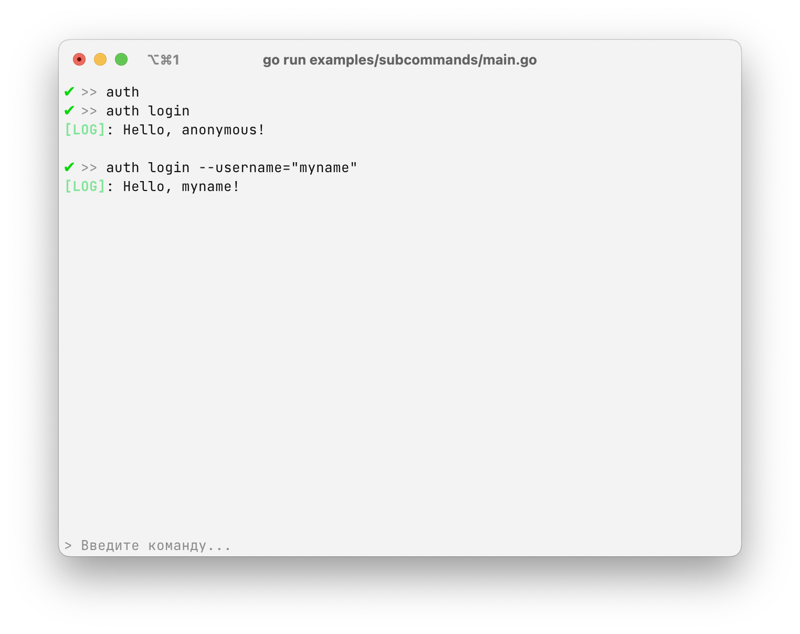

# `subcommands` - creating subcommands



To create a sub-command for your main command, use the `Subcommands` field inside `[]*replyme.Command`:

```go
Subcommands: []&replyme.Command{
    {
        Name: "mySubCommand",
        Usage: "testMySubCommand",
        Action: func (ctx *replyme.Context) error {
            // your code
is return nil
        }
    }
}
```

This way you can add additional subcommands to your REPL.

### Flag management

Flags can be used for both basic commands and additional commands.

For example: if the main `create` command had flags described, and then you added the `data` sub-command, then such a command will work fully.:

```plain text
create --myCreateFlag="test" data --myDataFlag="test"
```

To get acquainted with the work example, look at the [subcommands/main.go](./main.go) file.

### The flow of action

In order to work with commands and sub-commands, there is a specific execution flow, which can be viewed inside the example [Flow](../flow/README.md)